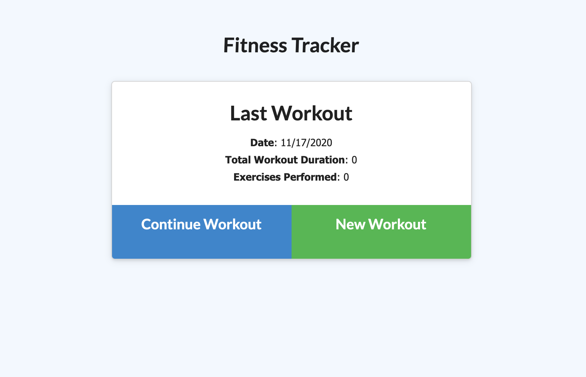
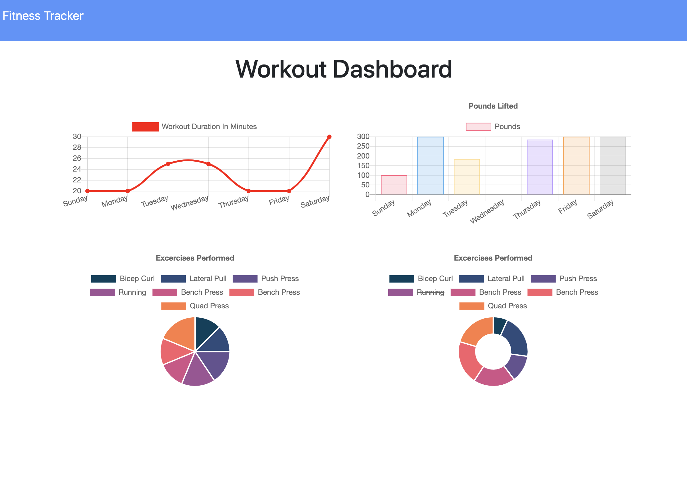

# Workout Tracker

  ## Description

  The workout tracker allows users to create new workouts and add on to their previous workout. The workout tracker also keeps a stats page of the last seven workouts and the combined weights of those workouts. This is good for users because they can continue to develop their workout based on their needs tthroughout the week. The workout tracker was made using express and mongoose. Seed files were entered via mongoDB atlas so that users can get and idea of what a 7 day workout would project like.
  

  ## Table of Contents

  *[installation](#installation)

  *[contributing](#contributing)

  *[questions](#questions)

  *[license](#license)

  *[test](#test)

  ## Installation

  To install necessary dependencies, run the following command: npm install

  ## Contributing 
  Joseph Meus and Some help with deployment from Tessa Peirce 

  ## License
    
      This Project is licensed under the MIT

  ## Tests 

  To run tests, run the following command:
  npm

  ## Questions 

  If you have any questions, feel free to contact me at meusjoseph21@gmail.com. 

  More of my work can be found at [meusjoseph21](https://github/com/meusjoseph21)

## Example Images

## Deployed Website 

https://whispering-tundra-57532.herokuapp.com/?id=5fb445ff2b1c55001769b0ca